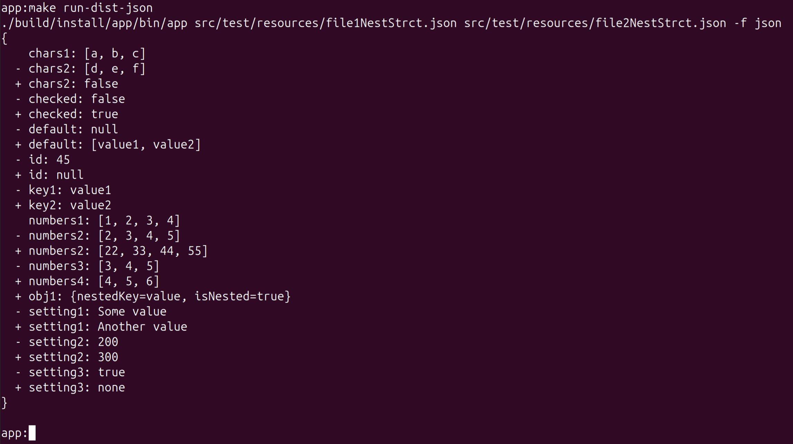
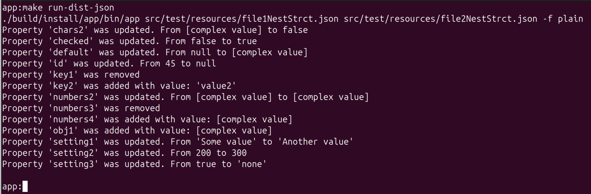
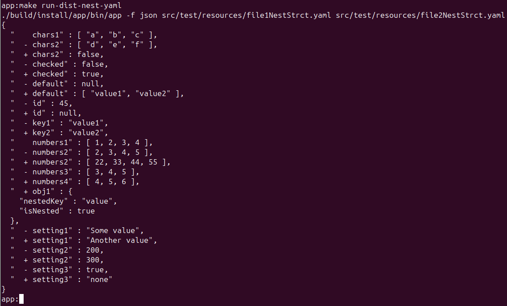

### Hexlet tests and linter status:
[](https://github.com/VictorGotsenko/java-project-71/actions)
[](https://github.com/VictorGotsenko/java-project-71/actions/workflows/DifferenceCalculator.yml)
[](https://codeclimate.com/github/VictorGotsenko/java-project-71/maintainability)
[](https://codeclimate.com/github/VictorGotsenko/java-project-71/test_coverage) 

### This small app for compare difference between two data files (such as JSON, YAML).
### How to use:
```shell
make install-dist
```
### The result of the work is on the screenshot below: 
#### An example of comparing two files using the "Stylish" formatter

#### An example of comparing two files using the "Plain" formatter

#### An example of comparing two files using the "JSON" formatter


